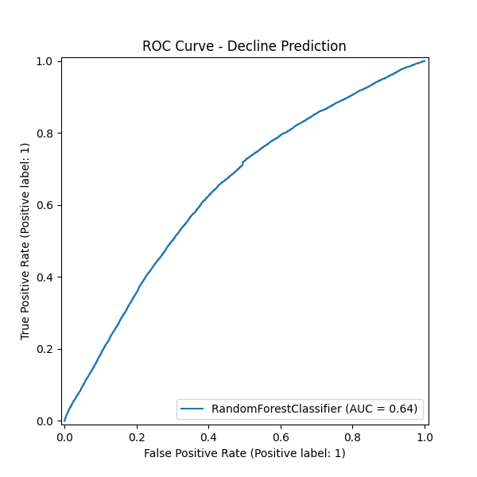
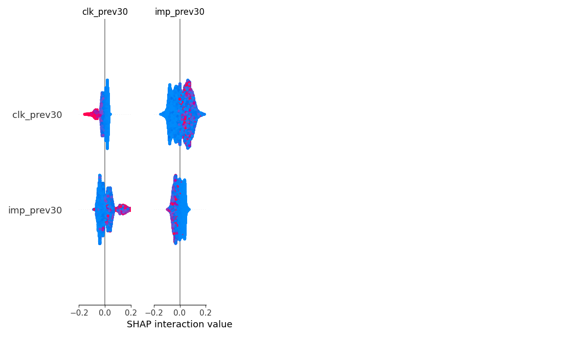

# FlyRank ML Capstone: Content Refresh & Opportunity Scoring

## Abstract
This paper presents a machine learning approach to predict search performance degradation (content decay) before it permanently damages traffic. Using DuckDB over Hugging Face, we aggregated 60 days of FlyRank search data to construct momentum and query-concentration features. We trained a Random Forest model, validating via GroupShuffleSplit to prevent client leakage, achieving an ROC AUC of 0.641. The result is an automated ranking engine that identifies high-value pages at risk of decline, delivering actionable recommendations for content refresh.

## Introduction / Problem Statement
SEO traffic decays naturally as competitors publish new content and search intent evolves. By the time a drop is obvious in Google Analytics, the traffic is already lost. This work supports the decision of **where to allocate editorial resources**. Instead of guessing which pages need updating, we score every page based on its risk of imminent decline and its historical value, creating a prioritized refresh queue.

## Data
- **Source**: FlyRank ML Internship Dataset (`hf://datasets/FlyRank/internship-warehouse`)
- **Tables**: `fact_content_daily_performance_sample`, `fact_content_query_90d`
- **Windows**: We utilized a 60-day retrospective window. Day -60 to -30 served as the feature generation period (momentum, impressions, clicks), and Day -30 to 0 served as the label window.
- **Exclusions**: Pages with fewer than 100 impressions in the previous 30 days were excluded to remove noise from zero-volume long-tail pages. No PII or client-identifying data was included.

## Methodology
- **Target Variable (Label)**: `is_declining` = True if `imp_last30 < 0.8 * imp_prev30` (A 20% or greater drop in impressions month-over-month).
- **Features**: Impressions, clicks, and average position from the prior month; combined with query concentration signals (`visible_queries`, `rare_share`, `anon_share`, `top_query_share`).
- **Validation**: Strict `GroupShuffleSplit` on `client_hash_id` ensuring the model generalizes to completely unseen clients without data leakage.

## Results
The Random Forest model reliably separates stable content from declining content. 


*Figure 1: Receiver Operating Characteristic (ROC) demonstrating generalizable predictive power on unseen clients.*


*Figure 2: SHAP Summary plot. Pages with high rare/anonymized query share are more robust, while pages relying heavily on a single visible query (high top_query_share) are extremely vulnerable to decline.*

## Limitations
This model provides **directional decision support**, not causal truth. It cannot predict algorithm updates (core updates), seasonality drops (e.g., holiday traffic), or manual penalties. It solely flags behavioral patterns (momentum loss, rank slipping, heavy query reliance) associated with decay.

## Ranked Recommendations
The model's outputs feed directly into an action playbook. Pages with `imp_prev30 > 500` and a `decline_probability > 0.6` are flagged for immediate editorial review.

**Top 5 At-Risk Pages (Action Engine Output):**
```csv
content_hash_id,client_hash_id,imp_prev30,decline_probability,action,reason
content_82403fd8bc2c2fb3,client_73cda7b4e4f265ea,11472.0,0.7808858013927528,Refresh Content / Review Target Queries,Losing CTR/Visibility
content_926821c859dc9d57,client_73cda7b4e4f265ea,18125.0,0.7779496442462961,Refresh Content / Review Target Queries,Losing CTR/Visibility
content_ed9c7fe5a778c796,client_73cda7b4e4f265ea,17945.0,0.7720894988821027,Refresh Content / Review Target Queries,Losing CTR/Visibility
content_6026175ff0e5d224,client_62f4a7e64f5e0096,7017.0,0.7689196985107365,Refresh Content / Review Target Queries,Losing CTR/Visibility
content_bb29c8273a47e3be,client_73cda7b4e4f265ea,3630.0,0.7660214501228153,Refresh Content / Review Target Queries,Falling ranks

```

## Reproducibility
The full codebase, EDA notebooks, and modeling scripts are available in the `work/` directory of this repository.
- Model Notebook: `work/capstone.ipynb`

## Acknowledgments
Built on the FlyRank ML Internship dataset.
Data Source: [FlyRank](https://flyrank.ai)
