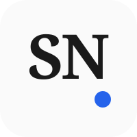

# Portfolio Identity Kit: Shlok Noval

## Logo / Favicon
*(A clean monogram combining the initials "S" and "N" with a subtle accent)*

---

## Typography
- **Heading Font:** Playfair Display (Serif) — *Used for titles, major section breaks, and the logo.*
- **Body Font:** Inter (Sans-Serif) — *Used for paragraphs, data tables, and high-legibility text.*

---

## Color Palette

| Role | Color Name | Hex Code | Preview |
| --- | --- | --- | --- |
| **Background** | Near-White | `#FAFAFA` |  |
| **Text** | Near-Black | `#1A1A1A` |  |
| **Main** | Professional Blue | `#2563EB` |  |
| **Accent** | Warm Amber | `#F59E0B` |  |

---

## Style Note

> Typography pairs the elegant Playfair Display with the highly legible Inter. The palette relies on stark contrast with a sharp blue and warm amber to keep the focus entirely on the work.
> 
> **Mood:** Analytical, direct, and quietly confident.
